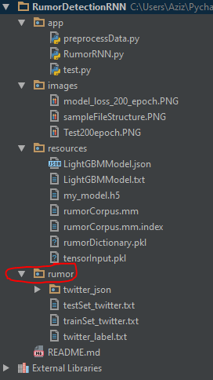

# RumorDetectionRNN

## Libraries used

1. gensim
2. keras
3. pickle

## Algorithm

### Dataset pre-process (preprocessData.py)

1. for each train file f in twitter_json, 
    1. put value of 'text' key in a list X_train, do this for all lines
    2. Tokenize X_train
    3. Convert each text in X_train to sequences
    4. pad X_train
2. dump X_train and Y_train using pickle
3. do step 1 and 2 for test every test file

### Training neural network

1. load trainX, trainY, testX, testY using <code>loadTensorInput()</code> Each item is now a list of list
2. categorize trainY and testY to two classes
3. build the neural net model using tflearn (LSTM RNN)
    1. activation='softmax'
    2. optimizer='adam'
    3. learning_rate=0.001
    4. loss='categorical_crossentropy'
4. fit the model
    1. n_epoch=20
5. save the model

## before running any file:

1. make sure that the dataset folder is inside the project and has name 'rumor'

## To create folder resources:

1. run preprocessData.py main function (createTensorInput(inputFile))

## To train neural network:

1. run RumorRNN.py main function 

## Result

5 epochs

Train on 875 samples, validate on 118 samples

20 epochs

<code>
Epoch 17/20
875/875 [==============================] - 14s - loss: 0.0627 - acc: 0.9840 - val_loss: 0.6850 - val_acc: 0.5678
Epoch 18/20
875/875 [==============================] - 14s - loss: 0.0600 - acc: 0.9863 - val_loss: 0.6829 - val_acc: 0.6186
Epoch 19/20
875/875 [==============================] - 14s - loss: 0.0595 - acc: 0.9817 - val_loss: 0.6905 - val_acc: 0.6186
Epoch 20/20
875/875 [==============================] - 15s - loss: 0.3526 - acc: 0.8960 - val_loss: 0.6753 - val_acc: 0.5932
118/118 [==============================] - 0s
Accuracy: 59.32%
</code>
Process finished with exit code 0
